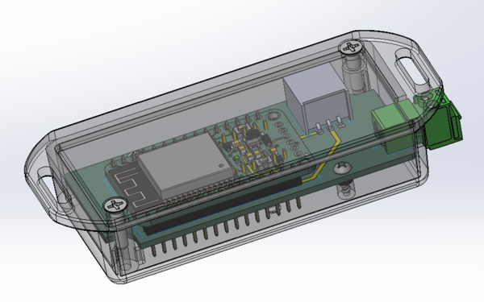
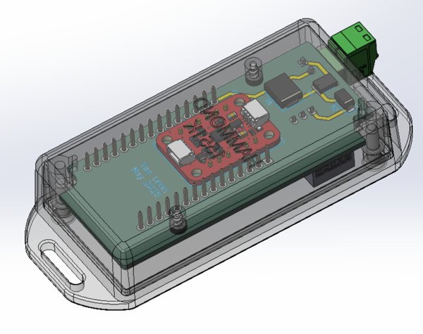
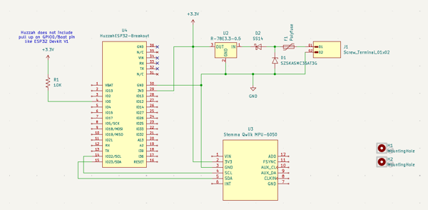
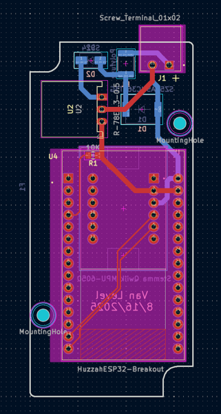

# Hardware

## Off the Shelf Hardware
- **Board:** [Adafruit ESP32 Huzzah Breakout](https://www.adafruit.com/product/4172)
- **IMU:**  Basic I2C 3-axis accelerometer.  Devices below have been verified to work
    - **MPU-6050:** [Adafruit MPU-6050 6-DoF Accel and Gyro Sensor - STEMMA QT Qwiic](https://www.adafruit.com/product/3886)
    - **ADXL343:** [ADXL343 - Triple-Axis Accelerometer - STEMMA QT / Qwiic](https://www.adafruit.com/product/4097)
    - **MSA311:** [Adafruit MSA311 Triple Axis Accelerometer - STEMMA QT / Qwiic](https://www.adafruit.com/product/5309)
- **Miscellaneous Components:**
    - **DC-DC Converter:** [Recom R-78E3.3-0.5](https://www.digikey.com/en/products/detail/recom-power/R-78E3-3-0-5/3593412) 
    - **Phoenix Wire Connector:** [Phoenix Mini Combicon MC 1840366](https://www.digikey.com/en/products/detail/phoenix-contact/1840366/349178) 
    - **Phoenix Board Connector:** [Phoenix Mini Combicon MC 1844210](https://www.digikey.com/en/products/detail/phoenix-contact/1844210/349195)  
    - **Polyfuse:** [1/2Amp PTC Resetable Fuse](https://www.digikey.com/en/products/detail/littelfuse-inc/1812L050-60MR/6234813) 
    - **TVS Diode:** [Littelfuse SZ5KASMC36AT3G](https://www.digikey.com/en/products/detail/littelfuse-inc/SZ5KASMC36AT3G/18716674) 
    - **Reverse Polarity Protection:** [Onsemi SS14](https://www.digikey.com/en/products/detail/onsemi/SS14/965474) 
- **Project Box:**  [Hammond 1551KFLBK](https://www.digikey.com/en/products/detail/hammond-manufacturing/1551KFLBK/2094805)
    - **Screws to Secure Board in Enclosure (2 per Project):** [#2 x 1/4" Thread-Forming Screw](https://www.mcmaster.com/products/90385a311/)
    - **3D Printed Washer (2 per Project):** [5/32"[4mm OD] x 5/64"[2mm ID] x 1/16"[1.5mm Thick]](<CAD Model/3D Printed Washer.STL>)

## Modifications to Off the Shelf Hardware
The Hammond enclosure will need a cutout for the Phoenix power connector.  The top will need a tall opening, while the bottom will need the lip removed in the connector area.  Two small washers can be 3D printed to lift the board just a little so the IMU board will clear the lid.
 

[Box cutout dimensions](<CAD Model/box_machining.pdf>) 
[Lid cutout dimensions](<CAD Model/lid_machining.pdf>)

## The PCB
[Kicad](https://www.kicad.org/) was used to design the very simple carrier board for the ESP32 development board and the IMU breakout board (the MPU-6050, ADXL343, and MSA311 boards from Adafruit all have the same header pinout).  This eliminated the need for point-to-point wiring and made a much more compact package possible.  You can also construct this project on strip board, dead bug style, or how ever you want.

The majority of the components are in the power supply.  Since this was for use in a vehicle, it needed to operate off of 12V.  You could easily use a power point (cigarette lighter for the older generation) to USB charger to operate the Huzzah board and then all you would need is a simple Qwicc cable to connect the Huzzah to the IMU.

The boards were produced by [OSHPark](https://oshpark.com/shared_projects/d4r7hpFr).  You can get three boards for $20 including shipping.  They are produced in the US and usually take a couple of weeks to arrive.  Of course, all of the Kicad source files are included in the repo if you want to send them to your favorite PCB manufacturer.

Assembly is straight forward.  Solder the lowest components first.  The Huzzah board was mounted on headers, but the IMU board was mounted directly on top of the carrier board to allow the IMU board to clear the inside of the box.
