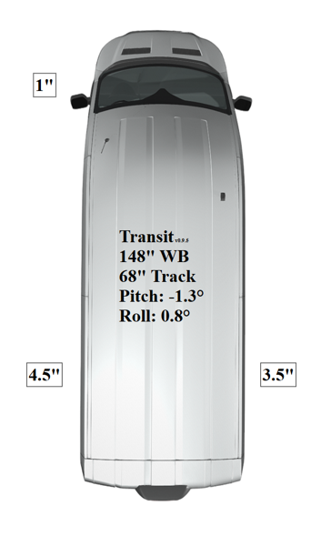
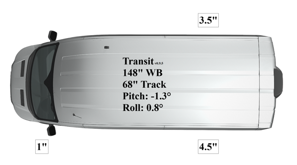
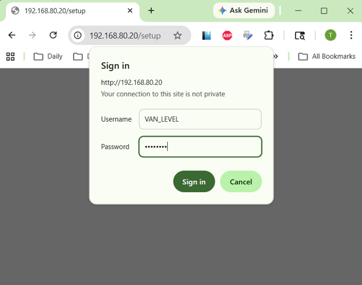
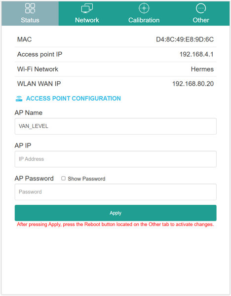
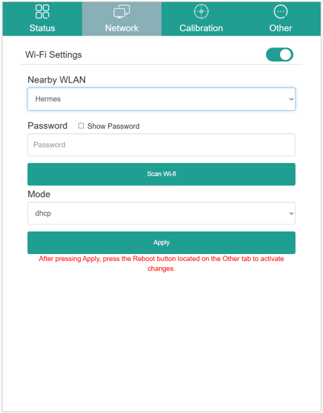
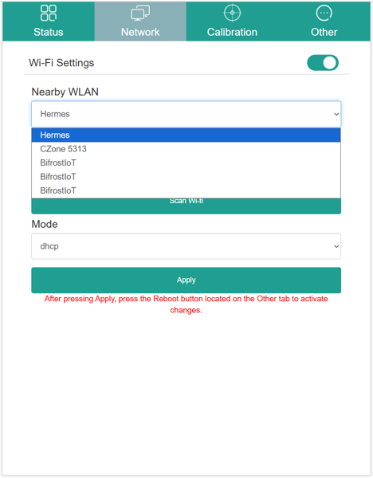
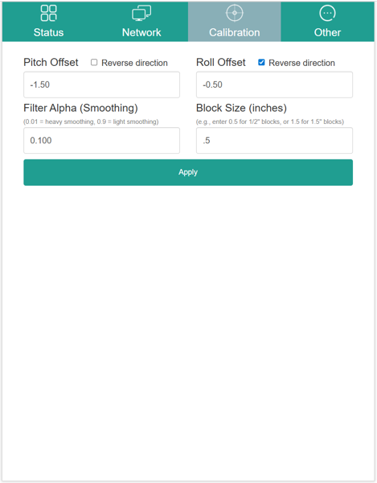
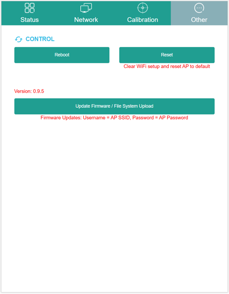
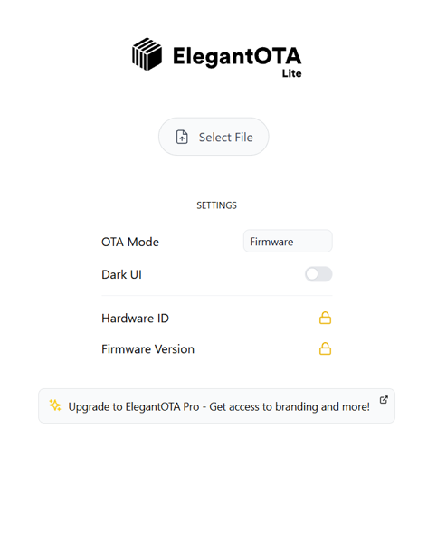

# Van Level

## Overview

ESP32 Based digital level to display leveling information for a camper van. This originally started as an ESPHome application however, the requirement to have Home Assistant running on your phone or tablet in order to see the leveling information was cumbersome.  It was decided that displaying the information on a simple web page, instead of a Home Assistant Lovelace overview, would be much easier to use.  However, there is also a [Home Assistant Dashboard](HOMEASSISTANT.md) setup available.

This app displays a simple webpage with a graphic of a camper van showing the amount of wheel lift (blocking) needed under each tire to level the van.  Included is the *Van Level* app, Kicad PCB files, and Solidworks files to modify a Hammond enclosure to contain the project.

## Product Images



## Project Structure

```
├── CAD Model/                       # SolidWorks 3D model of the board and Hammond enclosure
├── Notes/                           # Datasheets and component references
├── Van_Level_App/Van_Level          # Arduino ESP32 source code
│                 ├── data/          # App's LittleFS website
│                 │   ├── css/ 
│                 │   ├── images/
│                 │   └── js/
│                 └── HomeAssistant/ # RESTful Lovelace card for Home Assistant
├── Van_Level_PCB/                   # Kicad board files
│   └── Component Models/            # STEP files of board components
├── HARDWARE.md                      # Hardware specifications and components
├── HOMEASISTANT.md                  # Integrating with Home Assistant
├── README.md                        # This file
└── SOFTWARE.md                      # Software description
```

## [Hardware](HARDWARE.md)

## [Software](SOFTWARE.md)

## [Home Assistant](HOMEASSISTANT.md)

## Features
This application uses an ESP23 to read acceleration values from an IMU to calculate the pitch and roll values for a vehicles orientation.  These values are available via a RESTful API resource.  The ESP32's WiFi support is use to serve a self-hosted webpage to translate the pitch and roll information into leveling heights for each wheel using JavaScript.

The Wifi supports a standard network client, using either DHCP or static network setup, as well as a local Access Point for connecting directly to the device without a local network.

The leveling information can be viewed using any browser that supports Javascript. The webpage displays an image of a van, and a value next to each wheel requiring blocking.  The rounding of the height values presented can be adjusted to correspond to your leveling block height.  If you have 1" blocks, the rounding value can be set to change in 1" increments.

The van image can be changed to reflect your particular vehicle model and color, and the vehicle's wheelbase and track measurements can be edited to fit your particular van.  Details on these features are in [Software](SOFTWARE.md).

## Getting Started

### 1. Hardware Setup
1. Connect the ESP32 board to 12V DC power via connector C1 observing correct polarity
1. Connect to the built-in Access Point by opening your phone or computer Wifi Settings and selecting the `VAN_LEVEL` access point.
1. The default password for the access point is `12345678`.
1. The default name `VAN_LEVEL` and password `12345678` can be changed later.
1. Open the app webpage in any browser by navigating to the hotspot address `192.168.4.1`.
1. Your browser window should look something like this:
<br>

### 2. AP Configuration
1. To connect the *Van Level* app to your local network, or to change the default access point address, name, and/or password, we need to connect to the configuration page.  Navigate your browser to `192.168.4.1/setup`.
1. You will be asked for a login name and password.  These are the same as the AP name and password.
<br>
1. After pressing `Sign in`, your browser should now be displaying the app setup page with the `status` tab selected:
<br>
1. On this page, you can change the Access Point name, IP address, and password.
1. The setup page name and password **are the same** as the AP name and password.  If you change the AP name and/or password on this page, remember the values so you can log into the device configuration later.

### 3. Network Configuration
1. The `Network` tab allows you to connect the *Van Level* app to your local network.  Pressing the `Scan Wi-Fi` button will search for all available access points.  When the scanning is finished, selecting the `Nearby WLAN` dropdown will present a list of all APs found allowing your to select one.
<br>
1. You can now select DHCP or Static network configuration.  After you have made your selections and filled in the network password, click `Apply` and then reboot.
<br>
1. After the *Van Level* device has rebooted, your should now be able to connect to the device at the assigned IP address on your network in your browser.

### 4. Calibration

1. If the pitch or roll values of you van are not `0` when the van is level, you can enter the opposite amount here to tare the display.  For example, if your van shows +1.0° pitch when level, enter -1.0 in the pitch offset box.
1. Depending on how your mount the Van Level hardware, your pitch and roll values might move in the opposite direction.  Positive pitch should be nose up, and positive roll should be clockwise looking forward (i.e. drivers side higher than the passenger side).  Select `Reverse Direction` if either of your values are opposite.
1. The `Filter Alpha` setting controls the amount of *dampening* on the pitch and roll readings. I have found a setting of `0.10` seems to be a good compromise between responsiveness and reading jitter.
1. The `Block Size` setting should be set to the smallest block thickness in your stash.  If you have plywood blocks, you might set this to `0.5` [1/2"].  If you use 2 by 12 blocks then you would set this to `1.5` [the nominal thickness of 1.5"].

### 5. Other

1.  `Reboot` will restart the Van Level device retaining all of your current settings.  Use this after making coniguration changes.
1.  `Reset` will clear your stored Wifi network information and restore the default AP captive portal name and password.  **Make sure** this is what you want before pressing `Reset`.  If you have forgotten your AP name and password and can no longer access the configuration page because of this, it is possible to reset the hardware physically.  This process is discussed in [Software](SOFTWARE.md).
1. Selecting `Update Firmware / File System Upload` will allow *Over The Air* updating of the program and webpages.  See [Software](SOFTWARE.md) for more information on this process.
<br>
